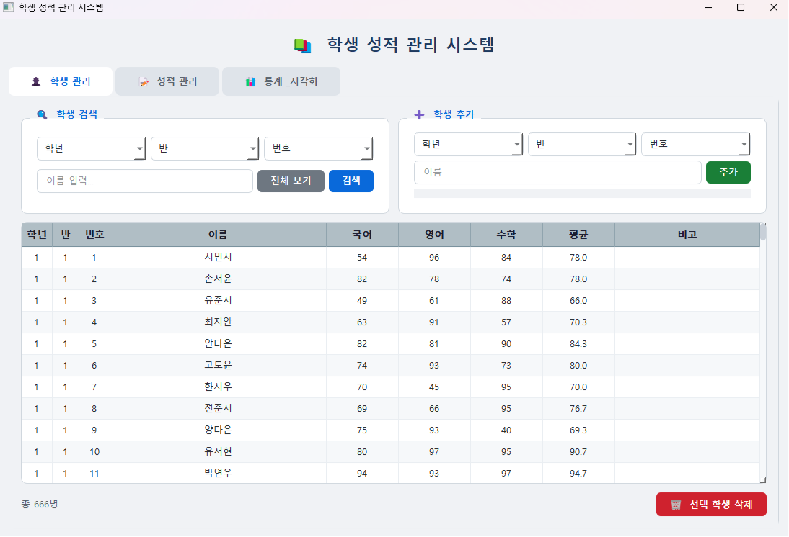
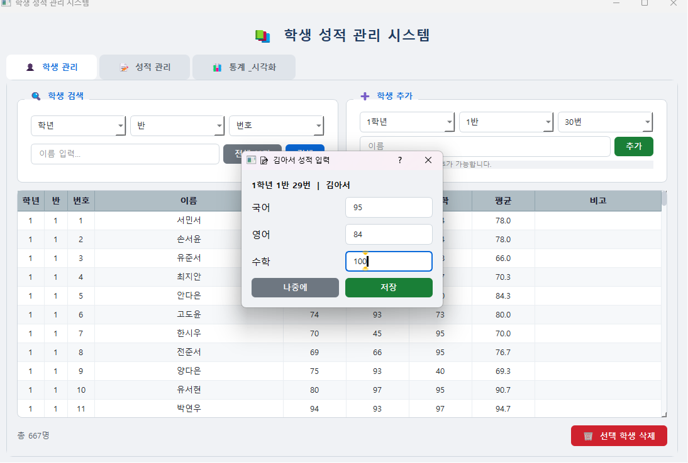
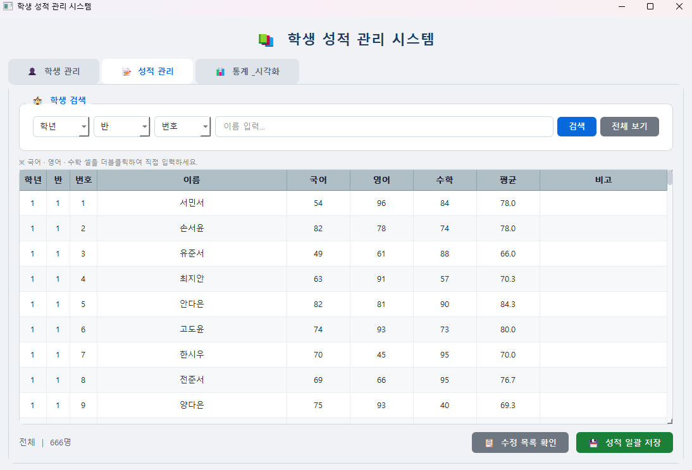
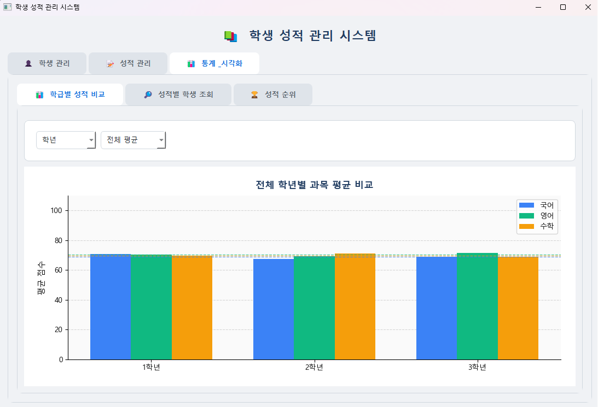
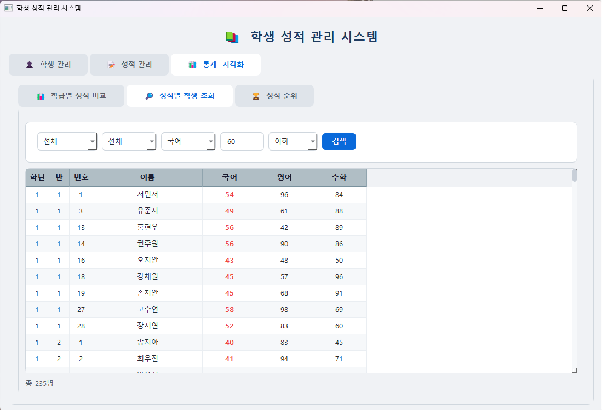
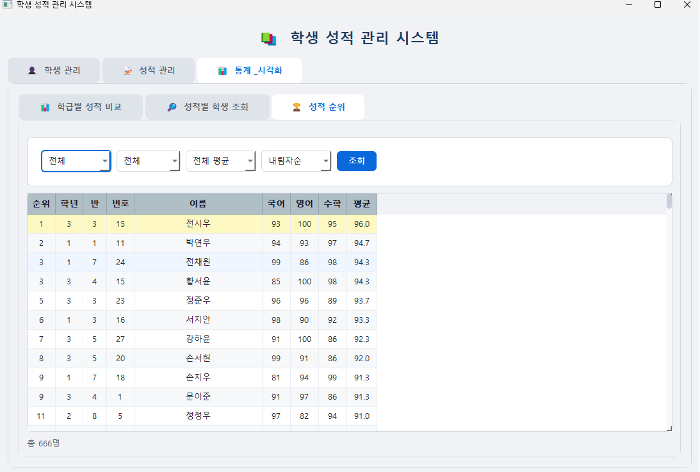

# 📚 Student Manager
> 학생 성적 관리 시스템 built using Python & PyQt5

  

---

## 📌 소개

Python과 PyQt5 프레임워크를 사용하여 만든 **학생 성적 관리 데스크탑 애플리케이션**입니다.  
학생 정보 관리, 성적 입력/수정, 통계 시각화까지 하나의 앱에서 관리할 수 있습니다.  
SQLite 데이터베이스와 연동되어 데이터가 영구적으로 저장됩니다.

---

## 📷 실행 화면

| 학생 관리 탭 | 성적 입력 팝업 |
|-----------|-----------|
|  |  |

| 성적 관리 탭 | 학급별 성적 비교 |
|-----------|-----------|
|  |  |

| 성적별 학생 조회 | 성적 순위 |
|-----------|-----------|
|  |  |

---

## ✨ 주요 기능

### 👤 학생 관리
- 🔍 **학생 검색** — 이름 또는 학년/반/번호로 검색
- ➕ **학생 추가** — 추가 가능한 번호 자동 안내 및 성적 입력 팝업 제공
- 🗑️ **학생 삭제** — 선택 학생 삭제
- 📝 **비고 입력** — 비고란 직접 입력/수정 (즉시 DB 저장)

### 📝 성적 관리
- ✏️ **성적 입력** — 국어/영어/수학 셀 더블클릭으로 직접 입력
- 🔵 **수정 표시** — 수정된 항목 파란색 Bold 강조
- 📋 **수정 목록** — 저장 전 수정 목록 팝업으로 확인
- 💾 **일괄 저장** — 성적 일괄 저장
- 🔀 **정렬** — 국어/영어/수학/평균 헤더 클릭으로 오름차순/내림차순 정렬

### 📊 통계 & 시각화
- 📈 **학급별 성적 비교** — 학년/반별 과목 평균 막대그래프 (자동 갱신)
- 🔎 **성적별 학생 조회** — 학년/반/과목/점수/이상·이하 조건으로 학생 조회
- 🏆 **성적 순위** — 학년/반/과목별 순위 조회 (오름차순/내림차순)

---

## 🚀 설치 및 실행

### 요구사항

- Python 3.10 이상
- PyQt5 5.15 이상

### 설치

```bash
# 1. 가상환경 생성 및 활성화
python -m venv venv

# Windows
venv\Scripts\activate

# Mac / Linux
source venv/bin/activate

# 2. 패키지 설치
pip install -r requirements.txt
```

### 실행

```bash
python main.py
```

> 최초 실행 시 `student.db`가 자동 생성되며 랜덤 샘플 데이터가 입력됩니다.

---

## 🎮 사용법

### 학생 관리
```
학생 검색 — 학년/반/번호 선택 또는 이름 입력 후 검색
학생 추가 — 학년/반 선택 시 추가 가능한 번호 자동 표시 → 이름 입력 후 추가
성적 입력 — 학생 추가 완료 후 성적 입력 팝업 자동 표시
```

### 성적 관리
```
학년/반/번호 선택 또는 이름 검색으로 학생 불러오기
국어/영어/수학 셀 더블클릭 → 직접 입력
수정 목록 확인 버튼으로 저장 전 변경사항 확인
성적 일괄 저장 버튼으로 저장
```

### 통계 & 시각화
```
학급별 성적 비교 — 학년/과목 선택 시 자동 갱신
성적별 학생 조회 — 조건 설정 후 검색 버튼 클릭
성적 순위 — 학년/반/과목/정렬 선택 후 조회 버튼 클릭
```

---

## 🗃️ 데이터베이스 구조

| 컬럼 | 타입 | 설명 |
|------|------|------|
| grade | INTEGER | 학년 (1~3) |
| class_num | INTEGER | 반 (1~8) |
| num | INTEGER | 번호 |
| name | TEXT | 이름 |
| korean | INTEGER | 국어 점수 (0~100) |
| english | INTEGER | 영어 점수 (0~100) |
| math | INTEGER | 수학 점수 (0~100) |
| average | REAL | 평균 (자동 계산) |
| note | TEXT | 비고 |

---

## 🗂️ 파일 구조

```
student_manager/
├── main.py
├── requirements.txt
├── README.md
├── .gitignore
├── images/
│   ├── tab0.png
│   ├── tab1.png
│   ├── tab2.png
│   ├── tab3.png
│   ├── tab4.png
│   └── tab5.png
├── database/
│   └── db_manager.py
└── views/
    ├── main_window.py
    ├── student_tab.py
    ├── score_tab.py
    ├── stats_tab.py
    ├── stats_class_tab.py
    └── stats_search_tab.py
```

---

## 🛠️ 기술 스택

- **Language** — Python 3
- **UI Framework** — PyQt5
- **Database** — SQLite3
- **Visualization** — Matplotlib

---

## 📌 참고 사항

- `venv/`, `*.db` 파일은 Git에 포함되지 않습니다.
- DB 초기화가 필요한 경우 `database/student.db` 파일을 삭제 후 재실행하세요.
- 한글 폰트는 Windows 기준 `Malgun Gothic`이 자동 적용됩니다.

---

## 👩‍💻 개발자

- GitHub: [@Jenny5789](https://github.com/Jenny5789)
